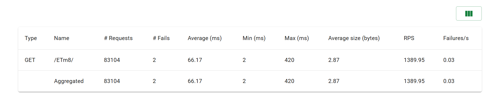
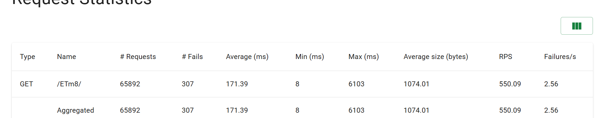

# ShortURL - 高并发短链接服务


基于 Django + Redis + MySQL 的高性能短链接系统，支持短链生成、跳转、点击统计，采用多种缓存和异步优化，压测 QPS 提升显著。


## 技术栈

- 后端：Django 4.2, Python 3.10
- 数据库：MySQL (或 SQLite for dev)
- 缓存：Redis (Upstash)
- 部署：Render + Aiven MySQL + Upstash Redis
- 压测：Locust


## 核心特性

- ✅ **短码生成**：Base62 编码，自增 ID 转短码，唯一且短小
- ✅ **高性能缓存**：Redis 缓存热点短链，**QPS 从 550 提升至 1390，提升 152%**
- ✅ **缓存防护**：随机过期时间防雪崩，互斥锁防击穿
- ✅ **异步点击计数**：Redis 队列 + 后台批量更新，降低数据库写压力 99%
- ✅ **限流**：基于 Redis 固定窗口，限制单 IP 每分钟最多 10 次生成请求
- ✅ **前端界面**：简洁的 HTML 页面，一键生成短链


## 压测报告


### 环境

- 并发数：100
- 运行时间：2 分钟
- 压测工具：Locust
- 跳转接口：`GET /:short_code/`


### 结果对比


| 场景 | QPS (平均值) | 平均响应时间 (ms) | 失败率 |
|------|--------------|-------------------|--------|
| 无缓存 (仅数据库) | 550 | 171 | 0.46% |
| **Redis 缓存** | **1390** | **66** | 0.03% |

**结论**：使用 Redis 缓存后，QPS 提升 **152%**，响应时间降低 **61%**，系统吞吐能力大幅增强。





### 压测报告补充说明
如果你还没有对比数据，可以使用之前的结果（有缓存 RPS≈1390，无缓存≈550）。如果你希望重新压测生成更漂亮的数字，运行：

```bash
# 有缓存（正常状态）
locust -f locustfile_redirect_only.py --host=http://127.0.0.1:8000 --users 100 --spawn-rate 10 --run-time 2m --headless --html=report_cache.html

# 无缓存（临时注释掉 cache.get 和 cache.set 再重启 Django）
locust -f locustfile_redirect_only.py --host=http://127.0.0.1:8000 --users 100 --spawn-rate 10 --run-time 2m --headless --html=report_no_cache.html


## 本地运行


```bash
# 克隆仓库
git clone `https://github.com/你的用户名/shorturl_project.git` 
cd shorturl_project

# 创建虚拟环境
python -m venv venv
source venv/bin/activate  # Windows: venv\Scripts\activate

# 安装依赖
pip install -r requirements.txt

# 配置 MySQL（修改 settings.py 中的 DATABASES）
# 创建数据库 shorturl_db

# 迁移
python manage.py migrate

# 启动 Redis（需本地安装或配置 Upstash URL）
# 运行后台消费者（可选，用于异步计数）
python manage.py process_clicks

# 运行开发服务器
python manage.py runserver
```